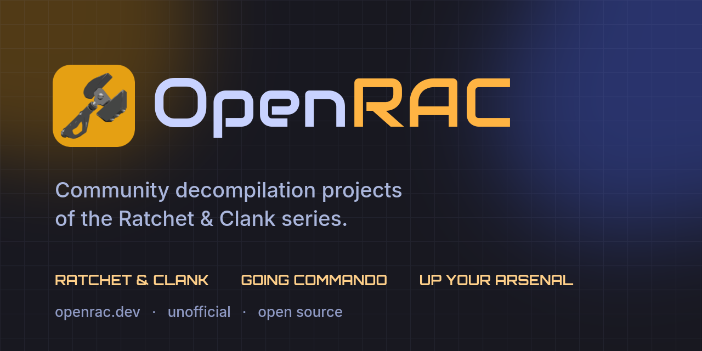

# OpenRAC website

The website of [OpenRAC](https://openrac.dev), an unofficial hub for community decompilation projects of the
*Ratchet & Clank* series. It shows, for every title, how far its decompilation has come.

Next.js (App Router) · TypeScript · Tailwind CSS 4 · everything is rendered on the server.

## How it works

The page is a server component. On the server it reads the state of each project from GitHub, renders plain
HTML and caches it; the browser gets finished HTML plus a few small scripts for the menu and animations.
No visitor ever calls GitHub. The page is rebuilt in the background at most every 5 minutes, the numbers are
cached for 10 minutes.

### How progress is counted

Every project is shown with one and the same measure: **code matched**, the bytes of code verified identical to
the retail build out of all code bytes the project counts. The percentage on each card and the line under its bar
(`838 628 of 3 712 808 code bytes matched`) are both this number; no card shows a project-specific extra. It is
weighted by size because small functions are matched first, and it is the figure decomp.dev shows.

Sources (see `src/lib/progress.ts`):

- **Ratchet & Clank (PAL)**: `progress/report.json` (objdiff report) of [`OpenRAC/rac1-decomp`](https://github.com/OpenRAC/rac1-decomp).
- **Ratchet & Clank (NTSC-U)**: `report.json` (objdiff report) on the `progress` branch of [`lombyte-project/Lombyte`](https://github.com/lombyte-project/Lombyte).
- **Going Commando**: `progress/report.json` (`integrated_code_bytes`) and `config/progress-scope.json` (total code) of [`llesieur99/rac2-decomp`](https://github.com/llesieur99/rac2-decomp).
- **Up Your Arsenal**: `progress_report.json` (objdiff report) of [`vetusmagnus/ratchet-uya-decomp`](https://github.com/vetusmagnus/ratchet-uya-decomp).
- **Going Mobile**: the verified method count in the `README.md` of [`Clank700/going-mobile-decomp`](https://github.com/Clank700/going-mobile-decomp), applied to the size of the reconstructed source.

If GitHub cannot be reached, the last known snapshot (in `progress.ts`) is shown and labelled as such.

## Blog

The blog lives at `/blog`. Posts are Markdown files in `content/blog/`, added through pull requests:

```yaml
---
title: A short title
date: 2026-09-30            # YYYY-MM-DD
summary: One or two sentences for the list page and link previews.
tags: [news]                # optional
author: Name                # optional
draft: true                 # optional, hides the post from the published site
---
```

The file name is the address (`my-post.md` becomes `/blog/my-post`). A bad header fails the build and names the file.
Raw HTML in posts is ignored and images must be files in `public/blog/` (remote images are dropped), so a post
cannot load anything from another server. There is an RSS feed at `/blog/rss.xml`, plus `sitemap.xml` and `robots.txt`.

## Credits

`src/lib/credits.ts` lists the people credited on the front page and their YouTube videos (links or video ids).
The section stays hidden until a video is listed. Titles and thumbnails are fetched by the server, and a video
loads from YouTube (privacy-enhanced `youtube-nocookie.com`) only when a visitor presses play, so nothing
reaches Google before that.

## Develop

```sh
npm install
npm run dev        # http://localhost:3000
npm test           # unit tests of the progress parser
npm run lint
npm run build
```

Copy `.env.example` to `.env.local` to change settings. `GITHUB_TOKEN` is optional and only raises the GitHub API
rate limit for the activity feed; it stays on the server.

### Card backdrops

The title cards can show a backdrop image named `rac1-bg.webp`, `gc-bg.webp`, `uya-bg.webp` and `going-mobile-bg.webp` (WebP, about
1600 px wide). Those would be screenshots from the games, which are copyrighted, so **they are not part of this
repository**. Without them the cards use a colour gradient.

The images are read from a folder, set by `IMAGE_DIR` (default `public/img`, which is git-ignored), on every
request. Drop a file in and it is used at once, with no rebuild or restart. Only those four names are ever
served. Resized copies are cached for a day, so a replaced image can take up to a day to show (or restart
the service after clearing the cache volume).

### Adding a title

Add an entry to `PROJECTS` in `src/lib/projects.ts`. If the project publishes progress, add a loader to
`src/lib/progress.ts`; a title without one is shown as "Not started". A second project for a game that is already
listed (another release, say) gets `sameGameAs` and a `region`: it becomes a tab on that game's card.

## Deploy with Podman and Quadlet

```sh
# 1. put this repository on the server and build the image
podman build -t localhost/openrac:latest .

# 2. install the unit (rootless shown; rootful: /etc/containers/systemd/)
mkdir -p ~/.config/containers/systemd
cp deploy/openrac.container ~/.config/containers/systemd/

# 3. start it
systemctl --user daemon-reload
systemctl --user start openrac.service
loginctl enable-linger "$USER"      # once, so it starts at boot without a login

# 4. card backdrops: copy your images into the folder the unit mounts (no restart needed)
cp rac1-bg.webp gc-bg.webp uya-bg.webp going-mobile-bg.webp ~/openrac-img/
```

The container listens on `127.0.0.1:3000`; put your reverse proxy in front of it. It runs as a non-root user with
a read-only filesystem and all capabilities dropped; only the page cache (`/app/.next/cache`) is a writable
volume. The backdrop folder `~/openrac-img` (created by the unit) is mounted read-only at `/data/img`; change the
host path in the `Volume=` line if you keep the images elsewhere. A health check polls `/healthz`. Edit `SITE_URL` in the unit to match your domain.

To update: `git pull && podman build -t localhost/openrac:latest . && systemctl --user restart openrac.service`.

## Legal

OpenRAC is an independent fan project, not affiliated with or endorsed by Sony Interactive Entertainment or
Insomniac Games. "Ratchet & Clank" and related names are trademarks of their owners and are used only to
identify the games the linked projects study. This repository contains no game assets, code or binaries.
